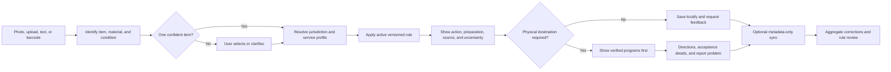

# Scrapp Product Requirements Document

## 1. Document control

| Field | Value |
|---|---|
| Product | Scrapp |
| Document type | Product Requirements Document (PRD) |
| Status | Draft for implementation and release planning |
| Version | 1.0 |
| Last updated | August 9, 2026 |
| Initial market | City of San Diego, California, United States |
| Product model | Free consumer web application; optional partner model later |
| Primary client | Mobile-first responsive Next.js application |
| Identification baseline | GPT-4o mini through the OpenAI Responses API |
| Design language | Route Label |

This PRD defines the target product, expected user experience, product-affecting technical and operational requirements, migration plan, and release gates. It is the product-level source of truth. Architecture documents, migrations, tests, and code may add implementation detail but must not contradict these requirements without an explicit product decision.

## 2. Executive summary

Scrapp helps people answer a deceptively difficult local question: "What should I do with this item here?"

The product begins with a photo, uploaded image, text description, and later a barcode. It identifies the likely item and material, resolves the user's jurisdiction and waste-service profile, applies a deterministic and versioned disposal rule, explains preparation and safety steps, cites the source, and provides a verified destination when curbside collection is inappropriate.

Scrapp must not behave like a generic image classifier that invents recycling advice. Identification is probabilistic; local disposal policy is deterministic. Those responsibilities must remain separate in the product, data model, APIs, tests, and interface.

San Diego is the first complete jurisdiction and quality benchmark. Scrapp remains free and useful without an account. Photos are processed transiently and are not stored in the cloud by default. History is local-first, and optional account sync may include decision metadata but not photos. Expansion is allowed only through a repeatable source-verification and jurisdiction-review workflow.

The product must be:

- Fast enough to use while standing at a bin.
- Honest about uncertainty, coverage, and data freshness.
- Local, source-backed, and service-profile aware.
- Accessible and comfortable on a small phone with one hand.
- Helpful when the answer is not curbside disposal.
- Privacy-preserving by default.
- Operationally measurable without collecting sensitive inputs.

## 3. Product vision and positioning

### 3.1 Vision

Make correct local disposal guidance as easy to access as taking a photo.

### 3.2 Product promise

Scrapp turns an item into a trusted local action: the correct bin, the necessary preparation, or a verified place to take it.

### 3.3 Positioning

For residents who are unsure how to dispose of an item, Scrapp is a local disposal decision assistant that combines easy item identification with verified jurisdiction rules. Unlike generic search, a broad recycling article, or a vision model acting alone, Scrapp presents a specific action, explains its limits, and links it to an official or verified source.

### 3.4 Product principles

1. **Local truth before a confident answer.** A definitive result requires a known jurisdiction or service profile and an active rule.
2. **Identify, then decide.** AI may suggest what the object is; it may not invent the final local route.
3. **Show the source.** Confirmed decisions include provenance, effective context, and a last-checked date.
4. **Uncertainty is a valid result.** Clarification and "local rule unavailable" are better than a fabricated answer.
5. **Every failure preserves a next action.** Permission denial, model failure, map failure, offline use, and unsupported coverage all retain a useful path.
6. **Privacy is the default.** Do not retain photos in the cloud or send private inputs to analytics.
7. **Verified destinations outrank nearby guesses.** Generic discovery is clearly separated and labeled "call to confirm."
8. **Anonymous use remains first class.** Accounts improve continuity but do not gate scanning, guides, or local decisions.
9. **Accessibility is product correctness.** WCAG 2.2 AA is a release standard.
10. **Expansion is earned.** A new jurisdiction launches only after its sources, exceptions, and regression cases meet the San Diego bar.

## 4. Problem definition

### 4.1 User problem

Disposal rules vary by municipality, property type, service provider, material condition, packaging type, and collection program. Residents must translate incomplete visual clues into local rules spread across municipal PDFs, hauler pages, facility directories, and search results.

Common failures include:

- Wish-cycling an item because it appears recyclable.
- Placing food-soiled or bagged recyclables in the wrong stream.
- Throwing hazardous, battery-powered, electronic, or reusable items in curbside bins.
- Following advice for the wrong city or service provider.
- Visiting a nearby business that does not accept the material.
- Treating model-generated advice as an official rule.
- Abandoning the task when camera permission, upload, geolocation, or network access fails.

### 4.2 System problem

The original product combined item identification and local-policy generation in one model response. That approach cannot reliably prove provenance, apply effective dates, distinguish service profiles, or prevent plausible but incorrect answers. It also entangles identification quality with policy accuracy.

### 4.3 Opportunity

Municipalities already publish authoritative information, but it is difficult to search at the point of decision. Scrapp can make it accessible through fast input, a canonical material vocabulary, deterministic rules, and verified location handoffs. The same architecture can support more jurisdictions without pretending rules are universal.

## 5. Goals and non-goals

### 5.1 Goals for the first six months

- Ship a stable Route Label product across the complete consumer journey.
- Support camera, image upload, and text description without an account.
- Separate AI identification from deterministic disposal decisions.
- Provide source-backed San Diego rules and explicit service-profile handling.
- Make every failure state understandable and recoverable.
- Provide local-first history that never reclassifies an item when opened.
- Prioritize verified special-disposal programs over generic nearby results.
- Create a structured correction and rule-review loop.
- Introduce optional metadata-only account sync and multilingual San Diego content.
- Validate the architecture with one additional jurisdiction before claiming broader coverage.
- Establish production accessibility, security, observability, analytics, cost controls, and automated testing.

### 5.2 Non-goals for the first six months

- Continuous live AI video scanning or passive background camera processing.
- Voice recognition as an input method.
- Cloud storage of scan photos.
- Open crowdsourced rules or automatic publication of corrections.
- Native iOS or Android applications.
- Payments, subscriptions, or consumer paywalls.
- Generic gamification or unsupported environmental impact estimates.
- Collection calendars or disruption alerts without reliable partner data.
- Worldwide coverage claims before a second jurisdiction passes all gates.
- Allowing a model, barcode service, or product database to decide the local rule.

## 6. Users and jobs to be done

### 6.1 In-the-moment disposer

A resident is holding an unfamiliar item in a kitchen, garage, trash room, workplace, or public space. They need a quick action without reading a long guide.

Jobs:

- Identify what I am holding and tell me what to do locally.
- Ask a simple clarification when condition or packaging changes the rule.
- Provide a trustworthy alternative when curbside disposal is unsafe.
- Say what is missing when the system cannot be certain.

### 6.2 Planner and household organizer

A user is sorting a pile, moving, cleaning a garage, or researching ahead.

Jobs:

- Search materials without taking a photo.
- Review prior decisions, including while offline.
- Find and compare verified destinations.
- Save a location and service profile once.

### 6.3 Multilingual resident

A resident needs the same locally accurate guidance in a preferred language.

Jobs:

- Read actions and preparation steps in the selected language.
- Retain official terminology where precision matters.
- Use layouts that remain functional with long translations.

### 6.4 Rule editor and reviewer

An internal operator maintains sources, rules, exceptions, and corrections.

Jobs:

- Ingest and compare official source changes.
- Preview affected materials and service profiles.
- Review, publish, expire, and roll back rule versions.
- Promote verified feedback into regression cases.

### 6.5 Future municipal or hauler partner

A scoped partner submits sources and reviews draft interpretations without directly publishing them or accessing private user inputs.

## 7. Market and coverage strategy

### 7.1 Initial coverage

San Diego is the initial supported jurisdiction. The product must distinguish City-serviced residences, multifamily or private-hauler properties, unknown-provider cases, and supported special programs such as batteries, household hazardous waste, electronics, bulky items, reuse, and donation.

### 7.2 Expansion criteria

A jurisdiction may enter pilot only when it has:

- Accessible official or contractually verified sources.
- Understandable jurisdiction and provider boundaries.
- A qualified local reviewer.
- A representative regression suite.
- A destination dataset or clearly labeled discovery fallback.
- Assigned ownership for source freshness and expiry.

### 7.3 Coverage communication

- Every confirmed decision shows the applied jurisdiction and service profile.
- Users outside supported areas never receive San Diego rules by default.
- Unsupported areas may receive safe general handling guidance, clearly labeled non-local and without a definitive bin.
- Marketing names only jurisdictions that have passed launch gates.

## 8. Product scope and implementation status

| Status | Meaning |
|---|---|
| Implemented | Present and expected to be preserved. |
| Partial | Present but needs hardening, integration, or acceptance testing. |
| Next | Required in the next product phase. |
| Later | Planned after the trust foundation is complete. |

### 8.1 Current baseline to preserve

- Next.js App Router frontend and route handlers.
- Route Label, Sora/Geist typography, semantic disposal colors, system theming, and dark camera workspace.
- `/cam` with camera, upload, and Describe modes.
- Explicit `/api/v2/identify` and `/api/v2/decide` separation.
- GPT-4o mini identification through the Responses API when configured.
- Deterministic San Diego rule evaluation for known materials.
- Multi-candidate selection rather than silent collapse.
- Versioned-source fields in disposal decisions.
- Guide, material, Locations, History, Settings, Account, trust, and partner routes.
- IndexedDB local history with legacy `ScanTicket` compatibility.
- Existing URLs, repeated `q` parameters, storage keys, and location handoffs.
- List-first mobile locations with an optional map.

### 8.2 Immediate gaps

- Missing OpenAI configuration must produce an operational error, never a false result.
- Source-backed rules must grow into a complete reviewed San Diego corpus.
- Jurisdiction and service-profile resolution need production boundary data.
- Feedback needs a reviewed server workflow.
- Optional accounts, metadata sync, multilingual content, and admin tools are incomplete.
- Destination verification must be explicit and consistently ranked.
- Monitoring, rate limiting, cost caps, privacy-safe identifiers, and events require release validation.

## 9. Information architecture

### 9.1 Public routes

| Route | Purpose | Account required |
|---|---|---|
| `/` | Marketing, product demo, supported areas, trust, and Scan/Describe entry | No |
| `/cam` | Photo, Upload, Describe, and later Barcode workspace | No |
| `/guide` | Search and browse local rules without vision | No |
| `/guide/[material]` | Material rule, preparation, exceptions, source, and handoff | No |
| `/locations` | Verified programs and separated generic discovery | No |
| `/history` | Local decisions, filters, search, deletion, and sync status | No |
| `/settings` | Language, jurisdiction, service, privacy, storage, accessibility | No |
| `/account` | Optional sign-in, sync, export, and deletion | Only for account actions |
| `/how-it-works` | Identification, rules, sources, privacy, and limits | No |
| `/about` | Mission, independence, coverage, and operating model | No |
| `/privacy` | Data collection, image handling, retention, and rights | No |
| `/terms` | Product limitations and legal terms | No |
| `/partners` | Future municipality, school, and hauler proposition | No |
| `/r/[token]` | Later: intentionally created redacted decision share page | Token only |

### 9.2 Internal routes

| Route | Purpose |
|---|---|
| `/admin/rules` | Source ingestion, drafting, comparison, review, publication, expiry, rollback |
| `/admin/feedback` | Triage item, rule, instruction, and destination reports |
| `/admin/evals` | Identification and rule regression review |
| `/partner` | Later: scoped source submissions and aggregate reports |

### 9.3 Navigation

- Marketing uses a full-width site line on desktop and a safe-area tab rail on mobile.
- The app shell uses mobile tabs for Scan, Guide, Locations, and History.
- Account and Settings live in the app header.
- `/cam` hides the global bottom bar and provides safe-area-aware Home and History controls.
- The Scrapp mark routes Home.
- Legal, privacy, source, coverage, and independence information remain public.

## 10. End-to-end product journey

### 10.1 Result hierarchy

Every result presents:

1. Identified item, using qualified "Looks like this item" language when uncertain.
2. Exact bin or special route as the dominant answer.
3. Preparation and safety instructions.
4. Clarification choices when identity, material, condition, or packaging changes the answer.
5. Applied jurisdiction and service profile.
6. Official or verified source, effective context, and last-checked date.
7. Nearby action only when a physical destination is appropriate.
8. "Was this right?" with separate correction paths.
9. Save, Share, and Scan Again actions where available.

An outage, malformed model response, missing rule, or empty fallback must never appear as a successful decision.

## 11. Functional requirements

Priorities: **P0** is required for a safe usable release, **P1** for the complete six-month product, and **P2** for later enhancement.

### 11.1 Input and identification

| ID | Priority | Requirement and acceptance criteria |
|---|---|---|
| FR-INP-01 | P0 | `/cam` provides Photo and Describe; Upload remains in Photo. Modes are labeled, keyboard operable, and retain jurisdiction context. |
| FR-INP-02 | P0 | Camera access is requested only after Use camera. Upload and Describe remain usable after denial. |
| FR-INP-03 | P0 | Denial, missing hardware, insecure context, unsupported browser, unreadable device, and camera-in-use produce distinct actionable states. |
| FR-INP-04 | P0 | Safe-area-aware capture controls do not overlap browser chrome or navigation in portrait or landscape; primary targets are at least 44 CSS pixels. |
| FR-INP-05 | P0 | Capture/upload enters Review with image, optional note, Retake/Replace, and Analyze. Classification never starts automatically. |
| FR-INP-06 | P0 | The client compresses images to the configured long edge and payload target. The server verifies byte length, signature, dimensions, and decompressed-pixel risk. The active flow, not merely a utility, is tested. |
| FR-INP-07 | P0 | Invalid type, size, corruption, or unreadable content each offers recovery. |
| FR-INP-08 | P0 | Browser classification traffic uses `/api/v2/identify`, then `/api/v2/decide`. Form submission must not create an opaque POST to `/cam`. |
| FR-INP-09 | P0 | During analysis the input stays visible, a live region announces non-quantified progress, and copy states analysis may take up to 20 seconds. |
| FR-INP-10 | P0 | Empty, excessive, or non-actionable descriptions are rejected with guidance. Known materials may bypass vision. |
| FR-INP-11 | P0 | Multiple plausible items are shown for explicit selection; no candidate is silently discarded. |
| FR-INP-12 | P1 | Clarification can capture material, contamination, battery presence, packaging form, condition, and reusability when these change a rule. |
| FR-INP-13 | P2 | Barcode uses native `BarcodeDetector` when available and lazy `@zxing/browser` otherwise; failure returns to Photo or Describe. Product data supplies hints only. |

### 11.2 Identification service

| ID | Priority | Requirement and acceptance criteria |
|---|---|---|
| FR-ID-01 | P0 | Identification returns candidates, material/condition evidence, hazards, confidence, uncertainty, metadata, and duration. It never supplies an authoritative local bin. |
| FR-ID-02 | P0 | Strict versioned schemas convert malformed, empty, refused, or incompatible output into a structured error, never success. |
| FR-ID-03 | P0 | Missing or invalid OpenAI configuration returns a safe 5xx with request ID; the UI offers Retry, Describe, and Guide. |
| FR-ID-04 | P0 | Confidence changes the flow. Ambiguous, multi-item, hazardous, and decision-sensitive cases require selection or clarification. |
| FR-ID-05 | P0 | Blank, irrelevant, dark, or unusable images produce retake/describe guidance, not a disposal result. |
| FR-ID-06 | P0 | Notes are supporting evidence only and never enter analytics or monitoring. |
| FR-ID-07 | P1 | Model name, prompt/schema version, latency, token/cost measures, and outcome are recorded without image or raw note. |
| FR-ID-08 | P1 | Model changes require evaluation gates for accuracy, latency, failures, and cost against the baseline. |
| FR-ID-09 | P1 | Privacy-safe device/session limits, payload limits, concurrency controls, timeouts, and daily/monthly caps bound abuse and cost. |

### 11.3 Jurisdiction and service profile

| ID | Priority | Requirement and acceptance criteria |
|---|---|---|
| FR-JUR-01 | P0 | A definitive rule requires resolved jurisdiction. Resolution accepts postal code, place, or coordinates and returns possible service profiles. |
| FR-JUR-02 | P0 | Fresh geolocation is requested only after Use my location. Denial leaves manual city/ZIP fully usable. |
| FR-JUR-03 | P0 | Unknown location never defaults to San Diego; the interface shows coverage unavailable or lets the user select a supported area. |
| FR-JUR-04 | P0 | Coordinates are transient for resolution/search and excluded from product analytics. |
| FR-JUR-05 | P0 | Profiles distinguish City service, private hauler, multifamily, and unknown provider. |
| FR-JUR-06 | P1 | Precedence is exact profile, municipality, region/state, national safe guidance, then explicit unavailable. |
| FR-JUR-07 | P1 | Existing `scrapp-locations-prefs` remains compatible and migrates to a versioned local profile. |
| FR-JUR-08 | P1 | Account sync may include an opted-in profile, never precise coordinates by default. |
| FR-JUR-09 | P1 | Home, Settings, About, and unsupported results publicly disclose coverage. |

### 11.4 Rules and provenance

| ID | Priority | Requirement and acceptance criteria |
|---|---|---|
| FR-RULE-01 | P0 | A deterministic TypeScript service produces the final decision. Identical material, condition, profile, jurisdiction, and time produce the same result. |
| FR-RULE-02 | P0 | Rules have effective intervals, priority, review status, and immutable published versions. |
| FR-RULE-03 | P0 | Confirmed decisions expose publisher, URL, title, language, last checked, and verification status. |
| FR-RULE-04 | P0 | Regional/national fallback displays its coverage level and cannot masquerade as local confirmation. |
| FR-RULE-05 | P0 | Missing or expired coverage returns clarification or local-rule-unavailable with safe alternatives. |
| FR-RULE-06 | P0 | Hazardous and prohibited-curbside rules override generic alias matches. |
| FR-RULE-07 | P1 | Exceptions support contamination, packaging, size, battery chemistry, reuse condition, and provider programs. |
| FR-RULE-08 | P1 | Published changes record author, reviewer, source set, timestamps, reason, and superseded version. |
| FR-RULE-09 | P1 | Overdue sources enter review; critical expiry may suppress confirmation. |
| FR-RULE-10 | P1 | San Diego facts live in data. A second jurisdiction uses the same engine and components without city-name code branches. |

### 11.5 Result, Guide, and Locations

| ID | Priority | Requirement and acceptance criteria |
|---|---|---|
| FR-RES-01 | P0 | The bin or special route is visually dominant and readable at 320px and 200% zoom. |
| FR-RES-02 | P0 | Blue, green, and gray are reserved for disposal meaning. Text/icons prevent color-only communication. |
| FR-RES-03 | P0 | Guidance is short and imperative; exceptions are progressive. |
| FR-RES-04 | P0 | Location appears only for eligible routes; Scan Again remains persistent. |
| FR-RES-05 | P1 | Source details show jurisdiction, profile, title, publisher, last checked, and link. |
| FR-RES-06 | P1 | Explicit share links exclude photo, note, exact address, device ID, and account data. |
| FR-GDE-01 | P0 | Guide search uses canonical aliases and locale terms without AI. |
| FR-GDE-02 | P0 | Stable server-rendered material pages contain initial HTML, rules, exceptions, and sources. |
| FR-GDE-03 | P0 | Guide always shows the applied context and never substitutes San Diego for unsupported coverage. |
| FR-GDE-04 | P1 | Browse covers curbside, drop-off, hazardous, electronics, bulky/reuse, and common confusion. |
| FR-GDE-05 | P1 | Previously cached guides remain readable offline with freshness status. |
| FR-LOC-01 | P0 | Mobile order is scan context, location, category, results. List is default; Map is optional. |
| FR-LOC-02 | P0 | Desktop uses a flexible list/map split rather than a cramped fixed list. |
| FR-LOC-03 | P0 | `category`, `item`, `bin`, repeated `q`, and existing URLs remain compatible; `decision` and `jurisdiction` may be added. |
| FR-LOC-04 | P0 | Geolocation failure never blocks manual search. |
| FR-LOC-05 | P0 | Verified facilities rank above generic discovery; generic entries are separately labeled "call to confirm." |
| FR-LOC-06 | P0 | Cards prioritize name, distance, accepted-item note, address, verification, restrictions, and Directions. |
| FR-LOC-07 | P0 | The list and directions remain useful if Maps is missing, offline, or failed. |
| FR-LOC-08 | P0 | Searching, no results, service failure, denial, map failure, and no-destination-needed are distinct states. |
| FR-LOC-09 | P1 | Mobile map code loads only when Map is selected. |
| FR-LOC-10 | P1 | Cards and markers synchronize with visible focus, keyboard support, accessible titles, and scroll restoration. |
| FR-LOC-11 | P1 | Result count/filter changes are visible and announced. |
| FR-LOC-12 | P1 | Users can report non-acceptance, closure, or incorrect facility data. |
| FR-LOC-13 | P1 | Verified/item-specific queries run first; generic category queries run only when needed. |

### 11.6 History, settings, accounts, and language

| ID | Priority | Requirement and acceptance criteria |
|---|---|---|
| FR-HIS-01 | P0 | IndexedDB stores local records/thumbnails. Legacy `scrapp-scan-history` imports once and is not deleted before confirmation. |
| FR-HIS-02 | P0 | Opening a saved decision creates no identification request and works offline. |
| FR-HIS-03 | P0 | Existing `ScanTicket` fields and 20-item legacy behavior remain accepted during migration. |
| FR-HIS-04 | P1 | Search/filter supports item, route, date, and favorite without network access. |
| FR-HIS-05 | P1 | Per-item deletion is direct; Clear All confirms scope across local and synced data. |
| FR-HIS-06 | P1 | Users can inspect storage, export readable metadata, and delete local data. |
| FR-HIS-07 | P1 | Stable scan IDs and idempotent persistence prevent duplicates. |
| FR-SET-01 | P0 | Settings cover language, jurisdiction, service, privacy, storage, and accessibility without requiring an account. |
| FR-SET-02 | P0 | Theme follows the system; camera remains dark. |
| FR-ACC-01 | P1 | Anonymous product use remains complete. Initial sign-in supports magic link and Google. |
| FR-ACC-02 | P1 | Sync is opt-in and metadata-only: decisions, favorites, preferences, and IDs, never photos/private notes. |
| FR-ACC-03 | P1 | Local import merges by stable ID. Export is readable; account deletion removes server-owned user metadata and explains local data. |
| FR-I18N-01 | P1 | English, Spanish, Tagalog, and Vietnamese form the San Diego pilot, including errors and source labels. |
| FR-I18N-02 | P1 | Translations point to the same rule version and show source language when different. Long strings pass responsive and zoom tests. |

### 11.7 Feedback and administration

| ID | Priority | Requirement and acceptance criteria |
|---|---|---|
| FR-FBK-01 | P0 | Feedback separates Wrong item, Wrong local rule, Instructions unclear, and Place does not accept it. |
| FR-FBK-02 | P0 | Reports include decision/rule ID, jurisdiction, issue type, and optional structured correction without photo or private note. |
| FR-FBK-03 | P1 | Reports never auto-publish. They enter review and preserve an immediate user recovery path. |
| FR-FBK-04 | P1 | Submission, review action, evaluation promotion, and resulting rule version are traceable. |
| FR-ADM-01 | P1 | Rule publication uses roles, required review, and RLS on user/partner-managed tables. |
| FR-ADM-02 | P1 | Preview shows source diff, scope, conflicts, and regression results before publication. |
| FR-ADM-03 | P1 | Expiry and rollback are auditable and never rewrite history. |
| FR-ADM-04 | P1 | Evaluation cases version expected identification/rule, context, consent, tags, and status. |
| FR-ADM-05 | P2 | Partners can submit sources and review assigned drafts but cannot publish. Reports are aggregate and private-input free. |

## 12. API and contract requirements

### 12.1 `POST /api/v2/identify`

Accept exactly one primary multipart mode: compressed image, description, or barcode, plus locale, jurisdiction hint, and privacy-safe device/session ID. Validate mode, bytes, signature, MIME type, dimensions, and pixels.

Return candidates, material/condition evidence, uncertainty, `requiresChoice`, model/schema metadata, duration, and request ID. Never return an authoritative local bin. Use structured 400/413/415/422/429/5xx errors. Refusal, timeout, configuration failure, and malformed output must be diagnosable without logging inputs or secrets.

### 12.2 `POST /api/v2/decide`

Accept selected candidate/material, structured condition, jurisdiction, service profile, locale, and controlled effective time for testing. Return a versioned `DisposalDecision`: route, semantic bin, preparation, safety, exceptions, clarifications, context, rule version, sources, freshness, and location eligibility. Missing coverage is a typed unavailable state. This endpoint does not invoke vision to invent policy.

### 12.3 Supporting APIs

- `GET /api/v2/jurisdictions/resolve`: accept coordinates, postal code, or place ID; return jurisdiction/profile candidates without retaining precise location.
- `GET /api/v2/materials/search`: return canonical materials, aliases, categories, and locale terms without invoking vision.
- `GET /api/v2/places`: accept decision/material and approximate location; return verified programs separately from discovery results.
- `POST /api/v2/feedback`: accept decision ID, issue type, structured correction, optional destination, and constrained comment; reject images, raw notes, barcodes, and coordinates.

### 12.4 Compatibility

Maintain `PredictionResult` and the legacy `/predict` adapter during migration. Preserve `/cam`, `/locations`, repeated `q`, `ScanTicket`, and storage keys. Deprecation requires low-use telemetry, a documented migration, and a rollback window. All schemas are versioned and contract-tested. Request IDs traverse client, handlers, model, rules, and Places without exposing secrets.

## 13. Core data model

- **Jurisdiction:** country, region, municipality, service boundaries, timezone, locales, status, coverage level, and review timestamps.
- **ServiceProfile:** jurisdiction, property type, public/private provider, collection program, effective interval, verification, and fallback behavior.
- **Material:** canonical ontology, aliases, categories, packaging, conditions, hazards, translations, hierarchy, and normalized search terms. It is jurisdiction-independent.
- **RuleVersion:** material and profile/jurisdiction scope, route, semantic bin, preparation, safety, exceptions, effective interval, review status, priority, sources, author/reviewer, reason, and superseded version.
- **RuleSource:** publisher, URL, title, language, document type, publication/effective date, last/next review, verification, lawful snapshot/checksum reference, and reviewer.
- **FacilityProgram:** facility/provider, accepted materials, restrictions, verified fees, appointments, contact, coordinates, service boundary, source, verification, and last checked.
- **DisposalDecision:** immutable snapshot of selected material, condition, context, rule, rendered guidance/source, location eligibility, confidence context, and creation time. It excludes photos and private notes from cloud persistence.
- **ScanRecord:** stable ID, input mode, candidate IDs, selected material, decision ID, duration, model/schema version, jurisdiction, timestamps, sync state, and optional local thumbnail reference.
- **Feedback:** decision, issue type, structured correction, constrained comment, destination reference, review state, actor, timestamps, and rule/evaluation links.
- **EvaluationCase:** consented or synthetic fixture reference, expected identification/rule, jurisdiction/profile, tags, source of truth, regression state, and review metadata.

## 14. Privacy, security, and safety requirements

### 14.1 Data minimization

- Scanning works anonymously.
- Photos are processed transiently and deleted after processing by default.
- No cloud photo bucket is required for the roadmap.
- Raw notes, barcode values, exact addresses, and precise coordinates are excluded from PostHog, Sentry, and equivalent telemetry.
- Metadata sync is opt-in and excludes photos and private notes.
- A random privacy-safe device identifier replaces a shared `anonymous` rate-limit identity. It is scoped and rotatable, not used for cross-site tracking.
- Retention periods are documented for request logs, feedback, account metadata, and operational telemetry.
- Privacy and Terms remain available before account creation and from every application shell.

### 14.2 Application security

- Validate image byte size, signature, MIME, dimensions, and decompressed pixels at the server boundary.
- Reject multiple primary input modes, unexpected fields, unsupported encodings, and oversized text.
- Apply backend rate limits to identification, place search, place photos, jurisdiction resolution, auth, and feedback.
- Store secrets only in server environment configuration; never expose OpenAI, Google, Supabase service-role, or observability credentials to the client.
- Emit a tested Content Security Policy covering only required Next.js, Google Maps, PostHog, Sentry, and deployment origins.
- Use secure headers, same-site cookies, CSRF-appropriate protections, and strict redirect allowlists.
- Enable Supabase RLS on every user-owned or partner-managed table. Service-role operations stay server-only.
- Prevent SSRF through source URLs, map/photo proxying, and future partner submission workflows.
- Sanitize user-visible source metadata and constrained feedback.
- Dependency, secret, and static analysis checks run in CI.
- Public health reports readiness without disclosing secrets, environment values, or dependency internals.

### 14.3 Safety behavior

- Hazardous uncertainty fails toward clarification or conservative handling, not curbside convenience.
- The product distinguishes informational guidance from emergency response. Damaged, hot, leaking, swollen, smoking, or otherwise dangerous batteries and chemicals require urgent safety language and appropriate official contacts.
- Medical, legal, or emergency disposal claims require reviewed sources and cannot be generated ad hoc.
- A facility card never claims acceptance based only on category proximity.
- The product clearly states that Scrapp is independent and is not an official City service unless a later agreement explicitly changes that status.

### 14.4 User controls

Users can:

- Use core features without an account.
- View what is stored locally and what would sync.
- Delete individual history, clear local history, export metadata, disable sync, and delete an account.
- Decline geolocation and use manual search.
- Decline camera access and use Upload or Describe.
- Report an incorrect item, rule, instruction, or destination.
- Open the source behind a confirmed decision.

## 15. Accessibility requirements

WCAG 2.2 AA is the minimum release standard.

### 15.1 Interaction

- All functionality is keyboard operable with logical focus order.
- A skip link reaches the main content.
- Focus is visible on all interactive elements in light and dark themes.
- Dialogs and sheets trap focus appropriately, provide a labeled close action, return focus to the trigger, and remain usable at 200% zoom.
- Primary mobile controls target at least 44 by 44 CSS pixels even though the WCAG minimum pointer target is smaller.
- Gestures have single-pointer alternatives; map use is never required.
- Pressed, selected, expanded, invalid, and loading states are programmatically conveyed.

### 15.2 Semantics and communication

- Pages use one meaningful `h1`, ordered headings, semantic landmarks, labeled forms, and descriptive links.
- Camera, upload, map markers, icon buttons, toasts, errors, progress, result counts, and filter changes have screen-reader names or live announcements.
- Disposal meaning is never color-only.
- Confidence is explained in plain language rather than exposed as an unexplained score.
- Error messages identify the problem and the next action.
- Source links disclose that they open an external site when appropriate.

### 15.3 Visual and responsive acceptance

Test at 320, 390, 430, 768, 1024, and 1440 CSS pixels; portrait and landscape camera; 200% zoom; system light/dark; high text expansion; and reduced motion. There must be no horizontal overflow, clipped critical content, hidden initial sections, obstructed controls, or unreadable semantic colors. Contrast is verified for text, controls, focus indicators, and meaningful graphics.

## 16. Design system and content requirements

### 16.1 Route Label foundation

- Cool off-white and charcoal canvases with teal primary actions.
- Blue, green, and gray are reserved for disposal semantics.
- Sora is the marketing display face; Geist is used for controls, guidance, and product UI.
- Page composition is open and editorial; clipped or notched physical labels replace generic rounded panels. Controls remain 10-12px, and pills are limited to compact states or selectors.
- Named z-index layers cover navigation, sheets, dialogs, and toasts.
- Motion uses 120ms, 200ms, and 320ms durations. Reduced motion replaces large transforms with minimal opacity changes or removes motion.
- Lucide remains the icon family, with standardized size, stroke, label, and semantic usage.
- Simple feedback uses CSS; Motion is limited to bounded transitions and layout continuity.

### 16.2 Page-level standards

- Landing content is server-rendered with small client islands.
- The hero uses "Snap it. Sort it right.", direct Scan and Describe actions, an original photographed specimen, a visible route line, and a labeled real-component answer fixture.
- Marketing contains no autoplay background video, fabricated statistics, fake endorsements, or invented environmental impact claims.
- Every section exists in initial HTML and never initializes invisible.
- The curbside guide uses asymmetric photographic blue/green/gray material fields.
- Surprise items scroll horizontally on small screens without trapping keyboard or touch users.
- Camera stays an immersive dark workspace regardless of system theme.
- Operational pages use one Route Label shell, predictable navigation, consistent loading/error/empty states, open content fields, purposeful dividers, and restrained elevation.
- Avoid neon AI styling, nested-card excess, decorative card grids, generic nature imagery, and motion without information value.

### 16.3 Content voice

Scrapp is calm, direct, local, and nonjudgmental.

- Prefer "Put it in the blue recycling bin" to vague labels such as "Recyclable."
- Prefer "Looks like a plastic film bag" when identification is uncertain.
- Prefer "We do not have a confirmed local rule for this address" to a broad guess.
- Explain preparation with verbs: Empty, Rinse, Keep loose, Tape terminals, Remove battery.
- Never shame a user for a prior mistake.
- Distinguish official source language from Scrapp's plain-language interpretation.
- Do not imply City endorsement.
- Translate meaning, not word order, and review safety-critical content with qualified speakers.

## 17. Performance, reliability, and offline behavior

### 17.1 Performance budgets

- Landing LCP is at most 2.5 seconds, CLS below 0.1, and INP below 200ms at the 75th percentile on representative mobile traffic.
- Landing hero media stays below 750 KB on mobile and 1.5 MB on desktop.
- Images have explicit dimensions, responsive formats, and appropriate loading priority.
- The previous large hero video is absent from source, build output, and production.
- Map code, barcode fallback, account tooling, and admin features are dynamically loaded outside critical journeys.
- Server Components remain the default; client components exist only for interaction, browser APIs, or bounded motion.
- Route bundle sizes are recorded on release and regressions are reviewed.
- Data-saver and reduced-motion preferences suppress nonessential media and animation.

### 17.2 Reliability

- `/api/health` reports application readiness and critical dependency status with bounded timeouts.
- Identification, decision, and Places calls use explicit timeouts and structured errors.
- Retries are bounded and idempotent; the UI does not create duplicate decisions or charges.
- A failed model response cannot be cached as success.
- Rule publication supports rollback without changing historical decision snapshots.
- Next.js classification replaces Flask only after shadow/contract parity. Flask remains available for one release rollback window, then is archived.
- Request IDs correlate failures across layers.
- Sentry captures sanitized errors; PostHog captures privacy-safe domain events; cost and latency telemetry have alerts.

### 17.3 Offline states

- Previously saved history and cached guide content remain readable.
- New photo analysis, uncached rules, live jurisdiction resolution, and live destination search clearly require connection.
- Map failure or offline status never removes already available list data.
- Offline banners are informative and do not cover navigation or capture controls.
- Returning online offers an explicit retry rather than silently resubmitting private input.

## 18. Analytics, evaluation, and success metrics

### 18.1 Event model

Capture privacy-safe domain events:

- Input workspace opened and mode selected.
- Camera permission outcome category.
- Review reached.
- Analysis started, succeeded, failed, timed out, or required choice.
- Decision viewed and source opened.
- Clarification answered.
- History opened.
- Location search opened, verified result viewed, and Directions clicked.
- Feedback issue type submitted.
- Account sign-in, local import, sync enable/disable, export, and deletion outcome.
- Offline limitation encountered.

Events may include route, input mode, coarse jurisdiction ID, model/schema version, duration bucket, error category, decision route, verification class, and experiment/release version. They never include the image, note, raw description, barcode, exact address, coordinates, source free text, or user-entered feedback comment.

### 18.2 Primary metrics

- **Completed decision rate:** sessions that reach a valid confirmed, clarification, or honest unavailable decision divided by qualified starts.
- **Identification agreement:** model selection compared with reviewed evaluation truth.
- **Rule accuracy:** decisions matching active reviewed rule fixtures.
- **User-reported agreement:** positive feedback rate, reported separately from measured accuracy.
- **Correction rates:** wrong item, wrong rule, unclear instruction, and bad location.
- **Latency:** p50 and p90 identify time and total decision time.
- **Provenance coverage:** percentage of confirmed results with active verified sources.
- **Source freshness:** percentage current and overdue-review count.
- **Verified destination coverage:** percentage of special-route decisions with at least one verified program.
- **Handoff conversion:** decision-to-location and Directions click rates.
- **Retention:** seven- and thirty-day anonymous/account return rate using privacy-safe methods.
- **Unit economics:** model, Places, storage, and observability cost per completed decision.

### 18.3 Initial targets

- Scan completion at least 85% among users who provide a valid input.
- p90 Analyze-to-result at most eight seconds under normal production conditions.
- One hundred percent of confirmed San Diego decisions reference an active rule version and source after Phase 2.
- Multi-item scans never silently select one item.
- History opens create zero identification requests.
- Account deletion removes all user-owned server metadata within the documented processing window.
- Both pilot jurisdictions use the same engine and API after Phase 4.
- Daily and monthly model/Places spend remains within configured caps.

Targets are reviewed after reliable production baselines exist. Scrapp does not publish diversion, emissions, or environmental impact claims without a documented calculation method and evidence.

### 18.4 Evaluation suite

The permanent suite includes:

- Clean versus contaminated packaging.
- Food-soiled paper and compostable-looking products.
- Expanded polystyrene packaging versus food containers.
- Plastic film and flexible mailers.
- Batteries by chemistry and condition.
- Cables, chargers, and electronic accessories.
- Bulky reusable versus damaged items.
- Hazardous containers and safety edge cases.
- Multiple foreground objects.
- No waste item, unreadable image, and adversarial text.
- The same material under different jurisdictions and service profiles.
- Source expiry, conflicting rules, and missing coverage.
- Model refusal, malformed structured output, timeout, and empty output.

Synthetic fixtures are clearly marked. User-derived fixtures require explicit consent and documented retention.

## 19. Testing strategy

### 19.1 Unit tests

Cover rule precedence/effective dates, service profiles, source expiry, aliases/locales, multi-item selection, clarification, storage migration, account merge, barcode normalization, product hints, privacy-safe event shaping, rate limits, and cost caps.

### 19.2 Contract and integration tests

Cover legacy `/predict`, v2 identify/decide schemas, model refusal/malformed/timeout/empty response, missing configuration, image validation, jurisdiction boundaries, Places separation, feedback validation, account/RLS boundaries, source publication, and request-ID propagation.

### 19.3 Browser tests

Cover camera granted, denied, ignored, unavailable, insecure, and occupied; upload/Describe success and failure; multiple candidates; clarification; local-rule unavailable; offline Guide/History; anonymous flow; optional sign-in/import/deletion; manual postal search; geolocation denial; verified destination; generic fallback; map failure; bad-place feedback; compatibility URLs/storage; and a regression assertion that classification uses API routes rather than POSTing to `/cam`.

### 19.4 Accessibility and visual testing

Run automated axe checks plus manual keyboard, screen-reader naming, focus return, focus visibility, contrast, 200% zoom, reduced motion, system themes, target widths, camera orientations, and long translated content. Final release review includes desktop/mobile screenshots and checks for overflow, hidden initial content, obstructed controls, console errors, and layout shift.

### 19.5 Build and CI gates

Standardize commands on Bun:

- `bun run test`
- `bunx biome check`
- `bunx tsc --noEmit`
- `bun run build`
- `bun run test:e2e`

While Flask remains, CI also runs Python formatting/static checks, unit/contract tests, upload-security tests, and health tests. Deployment is blocked if any required gate fails. Two consecutive clean production builds are required for foundational migrations.

## 20. Dependencies and integrations

### 20.1 OpenAI

Use GPT-4o mini as the evaluation baseline through the Responses API with Structured Outputs. The server owns credentials and orchestration. The model identifies; it does not author policy. A production model change requires the evaluation gates in this PRD.

### 20.2 Supabase

Use Postgres and Auth for rules, provenance, feedback, optional accounts, and metadata sync. RLS is mandatory. Initial sign-in is email magic link and Google. No cloud photo storage is enabled.

### 20.3 Google Maps and Places

Use Places for discovery and directions handoff, with verified Scrapp facility programs ranked separately. Advanced Markers must have accessible titles. The list remains primary and functional without Maps. API keys are domain/referer restricted and usage is capped.

### 20.4 Product and package hints

Open Food Facts may provide barcode-derived product/packaging hints. It is not authoritative for local disposal. Cache only normalized hints needed for performance and respect upstream licensing/attribution requirements.

### 20.5 Observability and analytics

Use Sentry for sanitized frontend/server errors and PostHog for privacy-safe domain events. Both integrations must pass payload inspection proving prohibited fields are absent.

### 20.6 Frontend platform

Next.js App Router, React, Tailwind/shadcn foundations, Lucide, Motion, IndexedDB, Playwright, and axe remain the preferred stack. React Bits, GSAP, continuous video AI, and a native rewrite remain excluded from this roadmap.

## 21. Phased roadmap

### Phase 0: stabilize and ship, 1-2 weeks

Deliver production parity with the checked-in Route Label experience; remove old video/statistics artifacts; standardize Bun scripts and CI; include browser/axe and Python gates; add/verify health, upload security, structured errors, backend rate limits, request IDs, timeouts, CSP, and privacy-safe scan identity; guarantee history viewing cannot classify; treat fallback as uncertainty/failure; add domain events; and publish Privacy/Terms.

**Exit:** production matches source; frontend/backend CI is green; health is correct; two clean builds pass; prohibited old media/claims are absent; no image or note appears in logs or analytics.

### Phase 1: trust-first consumer experience, 3-4 weeks

Complete Route Label across Scan, Result, History, Locations, loading, offline, permission, timeout, not-found, and route-error states. Finish Describe, multi-item selection, corrections, Guide/material pages, Settings, About, How It Works, IndexedDB controls, and destination verification presentation.

**Exit:** photo, upload, and text complete the journey; failures preserve action; multiple items never collapse silently; history makes no API call; completion is at least 85%; p90 Analyze-to-result is at most eight seconds.

### Phase 2: rules engine and provenance, 4-6 weeks

Create Supabase schema/migrations/RLS and reviewed San Diego seed data. Convert prompt facts and curated acceptance logic into versioned records. Model service profiles. Complete v2 APIs, rule editor, validation preview, review/expiry workflows, and shadow comparison. Move orchestration to Next.js while holding the model constant. Retire Flask only after parity and a rollback release.

**Exit:** all confirmed San Diego results have active sources; AI cannot choose a bin; uncovered cases clarify or report unavailable; representative regression fixtures pass; the Next.js classifier has no material latency/cost regression.

### Phase 3: accounts, multilingual San Diego, and correction operations, 3-4 weeks

Add optional magic-link/Google auth, one-time local metadata import, metadata-only sync, account export/deletion, English/Spanish/Tagalog/Vietnamese content, supported-area indicators, and internal feedback triage through rule publication and evaluation promotion.

**Exit:** anonymous use remains complete; account deletion works; no cloud photo bucket exists; all languages pass content/accessibility review; corrections are traceable to new rule versions.

### Phase 4: global pilot, barcode, and destination quality, 4-5 weeks

Select one qualified additional jurisdiction. Prove the schema has no San Diego-specific code path. Add progressive barcode mode, normalized product hints, verified/unverified destination API groups, bad-place reporting, freshness dashboards, cost controls, and query optimization.

**Exit:** both jurisdictions use the same interfaces and engine; unknown location never defaults to San Diego; verified destinations always outrank generic; barcode failure returns to Photo/Describe; costs remain capped.

### Beyond six months

Add three to five jurisdictions per verified-source cohort. Introduce a scoped partner portal. Consider schedules, disruption notices, and pickup links only with reliable partner feeds. Add education only in response to measured confusion. Consider native apps only if PWA evidence shows camera, notification, installation, or retention limits worth another client. Keep the consumer product free until accuracy, usage, destination quality, and funding evidence justify another model.

## 22. Release gates

### 22.1 Consumer release gate

- All P0 requirements for the released scope pass.
- No successful state is produced from missing configuration, fallback, malformed output, or absent local rule.
- Photo, Upload, and Describe each have a tested successful and failed journey.
- Source, context, and last-checked status appear on confirmed decisions.
- Compatibility URLs and storage migrations pass.
- Accessibility, target viewport, theme, orientation, zoom, and reduced-motion checks pass.
- Required automated commands and production build pass.
- Privacy payload inspection finds no prohibited input data.
- Monitoring, cost caps, and rollback procedures are active.

### 22.2 New jurisdiction gate

- Official/verified sources and boundaries are reviewed.
- Service profiles and exceptions are represented without jurisdiction-specific code.
- A local reviewer signs off.
- Regression fixtures cover curbside, hazardous, e-waste, bulky/reuse, destination, and no-coverage cases.
- Source ownership, freshness, expiry, and rollback are assigned.
- Localized content and layout are reviewed.
- Unsupported neighboring areas cannot receive the pilot jurisdiction's rules.

### 22.3 Model-change gate

- Fixed evaluation agreement is no worse than baseline for any safety-critical segment.
- Overall quality improves or maintains quality with a documented latency/cost benefit.
- Refusal, malformed output, and timeout behavior pass.
- Structured schema and contract compatibility pass.
- Shadow traffic reveals no material regression.
- Rollback configuration is tested.

## 23. Risks and mitigations

| Risk | Impact | Mitigation |
|---|---|---|
| Correct identification but wrong local rule | Unsafe or contaminating advice | Deterministic sourced rules, profile resolution, rule fixtures, no model-authored bins |
| Wrong jurisdiction/provider | Confident but irrelevant result | Explicit context, no San Diego default, boundary/profile resolution |
| Source becomes stale | Outdated guidance | Last checked, expiry queue, ownership, suppression for critical expiry |
| Generic Places result implies acceptance | Wasted trip or unsafe handoff | Verified-first ranking, separate discovery group, call-to-confirm label, feedback |
| Model outage or missing key looks like classification failure | User distrust and hard diagnosis | Structured operational errors, health, request IDs, fallback modes, browser tests |
| Multi-item image silently chooses one | Wrong decision | Explicit candidates and clarification |
| Photo/privacy leakage | High trust and compliance harm | Transient processing, no cloud bucket, payload inspection, redacted telemetry |
| Local migration loses records | User data loss | One-time idempotent import, confirm before legacy deletion, export controls |
| Accounts weaken anonymous flow | Adoption and trust loss | No account gates; sync is optional |
| Translation changes safety meaning | Incorrect action | Shared rule identity, qualified review, source language display |
| Costs scale unpredictably | Service interruption | Compression, known-material bypass, caching, rate limits, caps, alerts |
| Map dependency fails | Locations unusable | List-first UI, lazy map, directions fallback |
| Admin error publishes bad rule | Broad incorrect guidance | Role separation, preview, regression gate, immutable audit, rollback |
| Scope expands before foundation is trusted | Quality dilution | Phase exits and jurisdiction launch gates |
| Legacy Flask and Next.js diverge | Inconsistent results | Contract/shadow tests and time-boxed rollback window |

## 24. Assumptions and locked decisions

- Route Label, current color roles, Sora/Geist, dark camera, semantic bin colors, and WCAG 2.2 AA remain locked.
- San Diego is the first complete jurisdiction, but data and code are not hard-coded to it.
- Rule publication is limited to Scrapp editors and verified partners with review; community reports never publish automatically.
- Photos are deleted after processing and not stored in the cloud during this roadmap.
- Accounts are optional and sync metadata only.
- Scrapp remains free for at least the roadmap period; billing is not included.
- Existing routes, URL parameters, storage keys, persisted history, and production contracts remain compatible until a gated migration.
- Flask remains only until Next.js parity and rollback requirements pass.
- GPT-4o mini remains baseline until evaluation supports a change.
- React Bits, GSAP, continuous AI video, open crowdsourced rules, native rewrites, and generic gamification remain excluded.
- Scrapp is an independent assistant, not an official City service.
- Static fixtures and test mocks are permitted, but production never fabricates a successful backend response.

## 25. Open product decisions

These decisions require evidence or stakeholder approval before their phase begins:

1. Which property/service-profile questions produce the highest accuracy with the least friction in San Diego?
2. What precise source-review interval applies by route risk and publisher?
3. Which second jurisdiction best tests schema portability and has a qualified reviewer?
4. What comment constraints allow useful feedback while minimizing sensitive free text?
5. Should local thumbnails remain indefinitely, expire, or have a user-configurable retention policy after IndexedDB migration?
6. What stable anonymous-ID rotation balances abuse protection and privacy?
7. What confidence and evidence thresholds trigger automatic progression versus required choice?
8. Which rule fields must be translated by a human reviewer versus machine-assisted draft?
9. When should an expired source suppress a decision versus display a freshness warning?
10. What minimum verified-destination coverage is required before launching a special-route category?
11. What account retention and deletion processing window will Privacy and Terms promise?
12. What PWA evidence threshold would justify native applications?

Open decisions do not suspend locked privacy, safety, provenance, compatibility, or accessibility requirements.

## 26. Definition of done

A feature is done only when:

- Product behavior and copy meet the applicable requirement IDs.
- Happy, empty, loading, offline, permission, timeout, invalid-input, and service-failure states are addressed where relevant.
- Keyboard, screen-reader names, focus, contrast, reduced motion, target sizes, zoom, and responsive layouts are verified.
- Analytics events are privacy reviewed and exclude prohibited inputs.
- Unit, contract, browser, accessibility, and build tests appropriate to the change pass in CI.
- API/schema changes are versioned and compatibility impact is documented.
- Source-backed content has provenance, verification status, and freshness ownership.
- Security boundaries, rate limits, timeouts, and error shaping are tested.
- Performance impact and route bundle changes are reviewed.
- User-facing, operational, and rollback documentation is updated.
- No placeholders, fabricated success data, hidden initial content, console errors, or knowingly unhandled critical states remain.

## 27. Glossary

- **Candidate:** A possible item/material identity returned by the identification service.
- **Canonical material:** Jurisdiction-independent ontology entry used to match rules.
- **Clarification:** A user choice about identity, material, packaging, condition, or hazard needed before a decision.
- **Decision:** Immutable result of applying a rule version to selected material and local context.
- **Discovery result:** A generic nearby place without verified item acceptance.
- **Facility program:** A sourced record of a provider's accepted materials and restrictions.
- **Jurisdiction:** Geographic authority whose rules may apply.
- **Local-rule unavailable:** Honest outcome when Scrapp cannot confirm an applicable rule.
- **Rule source:** Official or verified evidence supporting a rule.
- **Rule version:** Reviewed time-bounded policy record used to create a decision.
- **Service profile:** Property/provider/collection context that determines which rules apply.
- **Verified destination:** Facility program whose relevant acceptance claim has a source and last verification date.
- **Route Label:** Scrapp's original specimen-to-route-to-answer-label design language, based on physical collection tags, material libraries, public signage, and optical inspection.

## 28. Final product standard

Scrapp succeeds when a resident can provide an item in the easiest available way, understand what the system believes it is, see a locally valid action with its source and limitations, recover when the system is uncertain or unavailable, and reach a verified destination when needed - all without surrendering a photo history or creating an account.

The product must optimize for trusted completed decisions, not scan volume, confident-sounding output, visual novelty, or unsupported environmental claims.
